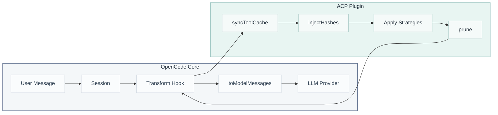

# Agentic Context Pruning (ACP)

[](https://www.npmjs.com/package/@tuanhung303/opencode-acp)

Automatically reduces token usage in OpenCode by intelligently managing conversation context.

## ⏩ Just Skip Reading This Readme

### It's the Age of Agents

- **Just paste this link into Open Code and ask it to explain.**
- Ask why context pruning is important and how ACP helps save tokens.

```
Hey please read this readme and tell me why I should use ACP: https://raw.githubusercontent.com/tuanhung303/opencode-acp/master/README.md
```

## 👶 Context Pruning Features

| Feature              | Technical: What actually happens                                                                                         |
| :------------------- | :----------------------------------------------------------------------------------------------------------------------- |
| **Discard**          | The AI identifies tool outputs it's "done" with and explicitly removes them from the conversation history.               |
| **Distill**          | Replaces large chunks of text (like file contents) with concise summaries to keep the "vibe" without the token cost.     |
| **Deduplication**    | Automatically spots repeated calls (like reading the same file twice) and keeps only the most recent version.            |
| **Supersede Writes** | If a file is `write` and then `read`, the original write input is pruned because the read output is the current "truth." |
| **Purge Errors**     | Keeps the error message but removes the massive stack traces or large inputs that caused the crash after a few turns.    |
| **Todo Reminder**    | Monitors `todowrite` usage. If the agent goes "rogue" without updating its list, it gets a nudge to refocus.             |
| **Turn Protection**  | A safety buffer that prevents any pruning for the last X messages, so the AI has context for its immediate next step.    |

## 🛠 Installation

### 👨‍💻 For Humans

Add to your OpenCode config:

```jsonc
// opencode.jsonc
{
    "plugin": ["@tuanhung303/opencode-acp@latest"],
}
```

Using `@latest` ensures you always get the newest version automatically when OpenCode starts. Restart OpenCode to begin.

### 🤖 For LLM Agents

Fetch this README and follow the instructions:

```bash
curl -s https://raw.githubusercontent.com/tuanhung303/opencode-acp/master/README.md
```

## How ACP Works

ACP hooks into OpenCode's message flow to intelligently reduce context size before sending to the LLM:



ACP uses multiple tools and strategies to reduce context size:

### Tools

**Discard** — Exposes a `discard` tool that the AI can call to remove completed or noisy tool content from context.

**Distill** — Exposes a `distill` tool that the AI can call to distill valuable context into concise summaries before removing the tool content.

### Strategies

**Deduplication** — Detects repeated tool calls with identical arguments (e.g., reading the same file multiple times) and retains only the most recent output. Earlier duplicates are replaced with lightweight placeholders. Runs automatically on every request with zero LLM cost.

**Supersede Writes** — Prunes `write` tool inputs when the same file has been subsequently `read`. The write content becomes redundant because the read output captures the current file state. Runs automatically on every request with zero LLM cost.

**Purge Errors** — Removes tool inputs for failed tool calls after a configurable turn threshold (default: 4). Error messages are preserved for debugging context, but potentially large input payloads are stripped. Runs automatically on every request with zero LLM cost.

**Todo Reminder** — Tracks `todowrite` activity and injects reminders when the agent neglects its task list. Helps maintain focus during long sessions by prompting the agent to review and update pending tasks.

> **Non-destructive:** Your session history is never modified. ACP replaces pruned content with placeholders only in the request sent to your LLM.

## Impact on Prompt Caching

LLM providers cache prompts using **exact prefix matching**—the KV (Key-Value) cache is reused only when the beginning of a new prompt is byte-for-byte identical to a cached prompt. Even a single character change invalidates the cache from that point forward.

| Provider  | Mechanism          | Min Tokens  | TTL       | Cache Discount |
| :-------- | :----------------- | :---------- | :-------- | :------------- |
| Anthropic | Manual breakpoints | 1,024–3,000 | ~5 min    | ~90% off       |
| OpenAI    | Automatic          | 1,024       | ~5–10 min | ~50% off       |

When ACP prunes a tool output mid-conversation, it changes message content and invalidates cached prefixes from that point forward.

**Trade-off:** You lose some cache read benefits but gain larger token savings from reduced context size and improved response quality through reduced context poisoning. In most cases, the token savings outweigh the cache miss cost—especially in long sessions where context bloat becomes significant.

> **Note:** In testing, cache hit rates were approximately 65% with ACP enabled vs 85% without.

**Best use case:** Providers that charge per-request (e.g., GitHub Copilot, Google Antigravity) see no negative price impact from cache invalidation.

## Configuration

ACP uses its own config file:

- Global: `~/.config/opencode/acp.jsonc` (or `acp.json`), created automatically on first run
- Custom config directory: `$OPENCODE_CONFIG_DIR/acp.jsonc` (or `acp.json`), if `OPENCODE_CONFIG_DIR` is set
- Project: `.opencode/acp.jsonc` (or `acp.json`) in your project's `.opencode` directory

<details>
<summary><strong>Default Configuration</strong> (click to expand)</summary>

```jsonc
{
    "$schema": "https://raw.githubusercontent.com/opencode-acp/opencode-acp/master/acp.schema.json",
    // Enable or disable the plugin
    "enabled": true,
    // Enable debug logging to ~/.config/opencode/logs/acp/
    "debug": false,
    // Notification display: "off", "minimal", or "detailed"
    "pruneNotification": "detailed",
    // Slash commands configuration
    "commands": {
        "enabled": true,
        // Additional tools to protect from pruning via commands (e.g., /acp sweep)
        "protectedTools": [],
    },
    // Protect from pruning for <turns> message turns
    "turnProtection": {
        "enabled": false,
        "turns": 4,
    },
    // Protect file operations from pruning via glob patterns
    // Patterns match tool parameters.filePath (e.g. read/write/edit)
    "protectedFilePatterns": [],
    // LLM-driven context pruning tools
    "tools": {
        // Shared settings for all prune tools
        "settings": {
            // Additional tools to protect from pruning
            "protectedTools": [],
        },
        // Removes tool content from context without preservation (for completed tasks or noise)
        "discard": {
            "enabled": true,
        },
        // Distills key findings into preserved knowledge before removing raw content
        "distill": {
            "enabled": true,
            // Show distillation content as an ignored message notification
            "showDistillation": false,
        },
        // Reminds agent to review/update todo list when stale
        "todoReminder": {
            "enabled": true,
            // Turns before first reminder (default: 12)
            "initialTurns": 12,
            // Turns between subsequent reminders (default: 6)
            "repeatTurns": 6,
        },
    },
    // Automatic pruning strategies
    "strategies": {
        // Remove duplicate tool calls (same tool with same arguments)
        "deduplication": {
            "enabled": true,
            // Additional tools to protect from pruning
            "protectedTools": [],
        },
        // Prune write tool inputs when the file has been subsequently read
        "supersedeWrites": {
            "enabled": false,
        },
        // Prune tool inputs for errored tools after X turns
        "purgeErrors": {
            "enabled": true,
            // Number of turns before errored tool inputs are pruned
            "turns": 4,
            // Additional tools to protect from pruning
            "protectedTools": [],
        },
    },
}
```

</details>

### Commands

ACP exposes a `/acp` slash command with the following subcommands:

| Command          | Description                                                                                                                      |
| :--------------- | :------------------------------------------------------------------------------------------------------------------------------- |
| `/acp`           | Lists available ACP commands                                                                                                     |
| `/acp context`   | Displays token usage breakdown by category (system, user, assistant, tools) and cumulative savings from pruning                  |
| `/acp stats`     | Shows aggregate pruning statistics across all sessions                                                                           |
| `/acp sweep [n]` | Prunes all tool outputs since the last user message. Optional `n` limits to the last N tools. Respects `commands.protectedTools` |

### Turn Protection

Prevents tool outputs from being pruned for a configurable number of message turns. This buffer ensures the agent can reference recent outputs before they become eligible for pruning. Applies to both manual tools (`discard`, `distill`) and automatic strategies.

### Todo Reminder

Monitors `todowrite` activity and injects reminders when the agent neglects its task list:

| Setting        | Default | Description                               |
| :------------- | :------ | :---------------------------------------- |
| `initialTurns` | 12      | Turns of inactivity before first reminder |
| `repeatTurns`  | 6       | Interval between subsequent reminders     |

- Reminders are prunable like any other content
- Only triggers when `pending` or `in_progress` todos exist
- Resets on `todowrite` calls (`todoread` alone does not reset)

### Protected Tools

These tools are always exempt from pruning across all strategies:

```
task, todowrite, todoread, discard, distill, batch, write, edit, plan_enter, plan_exit
```

Additional tools can be protected via `protectedTools` arrays in each config section.

### Config Precedence

Settings merge in priority order (later overrides earlier):

```
Defaults → Global (~/.config/opencode/acp.jsonc) → Config Dir ($OPENCODE_CONFIG_DIR/acp.jsonc) → Project (.opencode/acp.jsonc)
```

Restart OpenCode after modifying configuration.

## Limitations

**Subagents** — ACP is disabled for subagents. Subagent sessions prioritize returning concise summaries to the main agent over token efficiency. Pruning could interfere with this summarization behavior.

## License

MIT
