# Agentic Context Pruning (ACP)

[](https://www.npmjs.com/package/@tuanhung303/opencode-acp)
[](https://github.com/tuanhung303/opencode-agent-context-pruning/actions)
[](https://opensource.org/licenses/MIT)

<p align="center">
  
</p>

**Reduce token usage by up to 50% through intelligent context management.**

ACP optimizes LLM context windows by automatically pruning obsolete content—tool outputs, messages, and reasoning blocks—while preserving critical operational state.

---

## 📊 Context Flow Architecture

```mermaid
flowchart TB
    subgraph Input["📥 Input Layer"]
        U[User Message]
        T[Tool Outputs]
        M[Assistant Messages]
        R[Thinking Blocks]
    end

    subgraph Processing["⚙️ ACP Processing"]
        direction TB
        Auto["Auto-Supersede"]
        Manual["Manual Pruning"]

        subgraph AutoStrategies["Auto-Supersede Strategies"]
            H[Hash-Based<br/>Duplicates]
            F[File-Based<br/>Operations]
            Todo[Todo-Based<br/>Updates]
            URL[Source-URL<br/>Fetches]
            SQ[State Query<br/>Dedup]
        end

        subgraph ManualTools["Manual Tools"]
            D[Discard]
            Dist[Distill]
        end
    end

    subgraph Output["📤 Optimized Context"]
        Clean[Clean Context<br/>~50% smaller]
        L[LLM Provider]
    end

    U --> Processing
    T --> Auto
    M --> Manual
    R --> Manual

    Auto --> H
    Auto --> F
    Auto --> Todo
    Auto --> URL
    Auto --> SQ

    Manual --> D
    Manual --> Dist

    H --> Clean
    F --> Clean
    Todo --> Clean
    URL --> Clean
    SQ --> Clean
    D --> Clean
    Dist --> Clean

    Clean --> L

    style Input fill:#e1f5fe,stroke:#01579b,stroke-width:2px
    style Processing fill:#f3e5f5,stroke:#4a148c,stroke-width:2px
    style AutoStrategies fill:#fff3e0,stroke:#e65100,stroke-width:1px
    style ManualTools fill:#e8f5e9,stroke:#1b5e20,stroke-width:1px
    style Output fill:#e8f5e9,stroke:#2e7d32,stroke-width:2px
```



---

## 🚀 Quick Start

### Installation

```bash
npm install @tuanhung303/opencode-acp
```

Add to your OpenCode config:

```jsonc
// opencode.jsonc
{
    "plugin": ["@tuanhung303/opencode-acp@latest"],
}
```

### Basic Usage

ACP handles most pruning automatically. The following tools give agents granular control over context:

```typescript
// Discard completed work
context({ action: "discard", targets: [["a1b2c3"]] })

// Distill large outputs
context({
    action: "distill",
    targets: [["d4e5f6", "Found 15 TypeScript files"]],
})

// Batch operations
context({
    action: "discard",
    targets: [["hash1"], ["hash2"], ["hash3"]],
})
```

---

## 📚 Documentation

| Document                                                        | Purpose                                    |
| --------------------------------------------------------------- | ------------------------------------------ |
| [Validation Guide](docs/VALIDATION_GUIDE.md)                    | 43 comprehensive test cases                |
| [Test Harness](docs/TEST_HARNESS.md)                            | Ready-to-run test scripts                  |
| [Todo Write Testing Guide](docs/TODOWRITE_TESTING_GUIDE.md)     | Testing `todowrite` & stuck task detection |
| [Context Architecture](docs/CONTROLLED_CONTEXT_ARCHITECTURE.md) | Memory management strategies               |
| [Decision Tree](docs/PRUNING_DECISION_TREE.md)                  | Visual pruning flowcharts                  |
| [Limitations Report](docs/PRUNING_LIMITATIONS_REPORT.md)        | What cannot be pruned                      |
| [Changelog](CHANGELOG.md)                                       | Version history and migration guides       |

---

## 🤖 Agent Auto Mode

ACP provides the `context` tool for intelligent context management:

### Tool Interface

```typescript
context({
    action: "discard" | "distill",
    targets: [string, string?][]  // [[target, summary?], ...]
})
```

### Target Types

| Type                | Format      | Example            |
| ------------------- | ----------- | ------------------ |
| **Tool outputs**    | 6 hex chars | `44136f`, `01cb91` |
| **Thinking blocks** | 6 hex chars | `abc123`           |
| **Messages**        | 6 hex chars | `def456`           |

### Batch Operations

```typescript
// Prune multiple items at once
context({
    action: "discard",
    targets: [
        ["44136f"], // Tool output
        ["abc123"], // Thinking block
        ["def456"], // Message
    ],
})

// Distill with shared summary
context({
    action: "distill",
    targets: [
        ["44136f", "Research phase complete"],
        ["01cb91", "Research phase complete"],
    ],
})
```

---

## 🔄 Auto-Supersede Mechanisms

ACP automatically removes redundant content through multiple strategies:

### 1. Hash-Based Supersede

Duplicate tool calls with identical arguments are automatically deduplicated.

```
┌─────────────────────────────────────┐        ┌─────────────────────────────────────┐
│ BEFORE:                             │        │ AFTER:                              │
│                                     │        │                                     │
│   1. read(package.json) #a1b2c3     │   ───► │   ...other work...                  │
│   2. ...other work...               │        │   3. read(package.json) #d4e5f6◄──┐ │
│   3. read(package.json) #d4e5f6     │        │                                     │
│                                     │        │  First call superseded (hash match) │
│  Tokens: ~15,000                    │        │  Tokens: ~10,000  (-33%)            │
└─────────────────────────────────────┘        └─────────────────────────────────────┘
```

### 2. File-Based Supersede (One-File-One-View)

File operations automatically supersede previous operations on the same file.

```
┌─────────────────────────────────────┐        ┌─────────────────────────────────────┐
│ BEFORE:                             │        │ AFTER:                              │
│                                     │        │                                     │
│   1. read(config.ts)                │   ───► │                                     │
│   2. write(config.ts)               │        │   3. edit(config.ts)◄────────────┐  │
│   3. edit(config.ts)                │        │                                     │
│                                     │        │  Previous operations pruned         │
│  Tokens: ~18,000                    │        │  Tokens: ~6,000  (-67%)             │
└─────────────────────────────────────┘        └─────────────────────────────────────┘
```

### 3. Todo-Based Supersede (One-Todo-One-View)

Todo operations automatically supersede previous todo states.

```
┌─────────────────────────────────────┐        ┌─────────────────────────────────────┐
│ BEFORE:                             │        │ AFTER:                              │
│                                     │        │                                     │
│   1. todowrite: pending             │   ───► │                                     │
│   2. todowrite: in_progress         │        │   3. todowrite: completed◄────────┐ │
│   3. todowrite: completed           │        │                                     │
│                                     │        │  Previous states auto-pruned        │
│  Tokens: ~4,500                     │        │  Tokens: ~1,500  (-67%)             │
└─────────────────────────────────────┘        └─────────────────────────────────────┘
```

### 4. Source-URL Supersede

Identical URL fetches are deduplicated—only the latest response is retained.

### 5. State Query Supersede

State queries (`ls`, `find`, `git status`) are deduplicated—only the latest results matter.

---

## 🛡️ Protected Tools

These tools are exempt from pruning to ensure operational continuity:

```
task, todowrite, todoread, context, batch, write, edit, plan_enter, plan_exit
```

Additional tools can be protected via configuration:

```jsonc
{
    "commands": {
        "protectedTools": ["my_custom_tool"],
    },
}
```

---

## ⚙️ Configuration

ACP uses its own config file with multiple levels:

```
Priority: Defaults → Global → Config Dir → Project
```

- **Global**: `~/.config/opencode/acp.jsonc`
- **Config Dir**: `$OPENCODE_CONFIG_DIR/acp.jsonc`
- **Project**: `.opencode/acp.jsonc`

### Default Configuration

```jsonc
{
    "$schema": "https://raw.githubusercontent.com/tuanhung303/opencode-agent-context-pruning/master/acp.schema.json",
    "enabled": true,
    "autoPruneAfterTool": false,
    "pruneNotification": "minimal",

    "commands": {
        "enabled": true,
        "protectedTools": [],
    },

    "tools": {
        "discard": { "enabled": true },
        "distill": { "enabled": true },
        "todoReminder": { "enabled": true },
        "automataMode": { "enabled": true },
    },

    "strategies": {
        "deduplication": { "enabled": false },
        "purgeErrors": { "enabled": false },
        "truncation": { "enabled": false },
        "thinkingCompression": { "enabled": false },
        "supersedeWrites": { "enabled": false },
    },
}
```

### Aggressive Pruning (Opt-In)

Enable for up to **50% token savings**:

```jsonc
{
    "strategies": {
        "aggressivePruning": {
            "pruneToolInputs": true, // Strip verbose inputs
            "pruneStepMarkers": true, // Remove step markers
            "pruneSourceUrls": true, // Dedup URL fetches
            "pruneFiles": true, // Mask file attachments
            "pruneSnapshots": true, // Keep latest snapshot
            "pruneRetryParts": true, // Prune failed retries
            "pruneUserCodeBlocks": true, // Truncate old code blocks
            "truncateOldErrors": true, // Truncate old errors
            "aggressiveFilePrune": true, // One-file-one-view
            "stateQuerySupersede": true, // Dedup state queries
        },
    },
}
```

---

## 📊 Token Savings

| Metric              | Without ACP  | With ACP    | Savings |
| ------------------- | ------------ | ----------- | ------- |
| **Typical Session** | ~80k tokens  | ~40k tokens | **50%** |
| **Long Session**    | ~150k tokens | ~75k tokens | **50%** |
| **File-Heavy Work** | ~100k tokens | ~35k tokens | **65%** |

**Cache Impact**: ~65% cache hit rate with ACP vs ~85% without. The token savings typically outweigh the cache miss cost, especially in long sessions.

---

## 🧪 Testing

Run the comprehensive test suite:

```bash
# Load test todos
todowrite({ /* copy from docs/VALIDATION_GUIDE.md */ })

# Run preparation
prep-0 through prep-7

# Execute tests
t1 through t43

# Generate report
report-1 through report-4
```

See [Validation Guide](docs/VALIDATION_GUIDE.md) for detailed test procedures.

---

## 📋 Pruning Workflow

Complete example: execute tool → find hash → prune.

**Step 1: Run a tool**

```typescript
read({ filePath: "src/config.ts" })
// Output includes: <tool_hash>a1b2c3</tool_hash>
```

**Step 2: Find the hash in output**

```
... file contents ...
<tool_hash>a1b2c3</tool_hash>
```

**Step 3: Prune when no longer needed**

```typescript
context({ action: "discard", targets: [["a1b2c3"]] })
// Response: 「 🗑️ discard ✓ 」- ⚙️ read
// Available: Tools(5), Messages(2), Reasoning(1)
```

**Batch multiple targets:**

```typescript
context({ action: "discard", targets: [["a1b2c3"], ["d4e5f6"], ["g7h8i9"]] })
```

**Distill with summary:**

```typescript
context({ action: "distill", targets: [["abc123", "Auth: chose JWT over sessions"]] })
```

---

## 🏗️ Architecture Overview


ACP hooks into OpenCode's message flow to reduce context size before sending to the LLM:

1. **Sync Tool Cache** - Updates internal tool state tracking
2. **Inject Hashes** - Makes content addressable for pruning
3. **Apply Strategies** - Runs auto-supersede mechanisms
4. **Prune** - Applies manual and automatic pruning rules

---

## 📝 Commands

| Command          | Description                       |
| ---------------- | --------------------------------- |
| `/acp`           | List available commands           |
| `/acp context`   | Show token usage breakdown        |
| `/acp stats`     | Show aggregate pruning statistics |
| `/acp sweep [n]` | Prune last N tool outputs         |

---

## 🔧 Advanced Features

### Todo Reminder

Monitors `todowrite` usage and prompts when tasks are neglected:

```jsonc
{
    "tools": {
        "todoReminder": {
            "enabled": true,
            "initialTurns": 8, // First reminder after 8 turns without todo update
            "repeatTurns": 4, // Subsequent reminders every 4 turns
            "stuckTaskTurns": 12, // Threshold for stuck task detection
        },
    },
}
```

**Reminder Behavior:**

- **First reminder**: Fires after `initialTurns` (8) turns without `todowrite`
- **Repeat reminders**: Fire every `repeatTurns` (4) turns thereafter
- **Auto-reset**: Each `todowrite` call resets the counter to 0
- **Deduplication**: Only ONE reminder exists in context at a time; new reminders replace old ones
- **Stuck task detection**: Tasks in `in_progress` for `stuckTaskTurns` (12) are flagged with guidance
- **Prunable outputs**: Reminder displays a list of prunable tool outputs to help with cleanup

**Reminder Sequence:**

```
Turn 0:  todowrite() called (resets counter)
Turn 8:  🔖 First reminder (if no todowrite since turn 0)
Turn 12: 🔖 Repeat reminder
Turn 16: 🔖 Repeat reminder
...
```

### Automata Mode

Autonomous reflection triggered by "automata" keyword:

```jsonc
{
    "tools": {
        "automataMode": {
            "enabled": true,
            "initialTurns": 8, // Turns before first reflection
        },
    },
}
```

### Stuck Task Detection

Identifies tasks stuck in `in_progress` for too long:

```jsonc
{
    "tools": {
        "todoReminder": {
            "stuckTaskTurns": 12, // Threshold for stuck detection
        },
    },
}
```

---

## 🚧 Limitations

- **Subagents**: ACP is disabled for subagent sessions
- **Cache Invalidation**: Pruning mid-conversation invalidates prompt caches
- **Protected Tools**: Some tools cannot be pruned by design

---

## 🛠️ Troubleshooting

### Error: `reasoning_content is missing` (400 Bad Request)

**Cause:** Using Anthropic/DeepSeek/Kimi thinking mode with an outdated ACP version or missing reasoning sync.

**Fix:**

1. Update to ACP v3.0.0+: `npm install @tuanhung303/opencode-acp@latest`
2. Ensure your config has thinking-compatible settings
3. See [Thinking Mode Compatibility](docs/THINKING_MODE_COMPATIBILITY.md) for details

### Plugin Not Loading

**Symptoms:** Commands like `/acp` return "Unknown command"

**Fix:**

1. Verify plugin is in `opencode.jsonc`: `"plugin": ["@tuanhung303/opencode-acp@latest"]`
2. Run `npm run build && npm link` in the plugin directory
3. Restart OpenCode

### High Token Usage Despite ACP

**Check:**

- Is aggressive pruning enabled in config? See [Configuration](#configuration)
- Are you using protected tools excessively? (`task`, `write`, `edit` can't be pruned)
- Is your session >100 turns? Consider starting a fresh session

---

## 🔬 Provider Compatibility

### Thinking Mode APIs (Anthropic, DeepSeek, Kimi)

ACP is fully compatible with **extended thinking mode** APIs that require the `reasoning_content` field. The context tool automatically syncs reasoning content to prevent `400 Bad Request` errors.

**Supported providers:** Anthropic, DeepSeek, Kimi  
**Not required:** OpenAI, Google

See the [detailed technical documentation](docs/THINKING_MODE_COMPATIBILITY.md) for implementation details and the root cause of the original compatibility issue.

---

## 📦 npm Package

**Package**: `@tuanhung303/opencode-acp`  
**License**: MIT  
**Repository**: https://github.com/tuanhung303/opencode-agent-context-pruning

### Installation Methods

```bash
# Via npm
npm install @tuanhung303/opencode-acp

# Via OpenCode config
# Add to opencode.jsonc: "plugin": ["@tuanhung303/opencode-acp@latest"]

# Via URL (for agents)
curl -s https://raw.githubusercontent.com/tuanhung303/opencode-acp/master/README.md
```

### CI/CD

- **CI**: Every PR triggers linting, type checking, and unit tests
- **CD**: Merges to `main` auto-publish to npm

---

## 🤝 Contributing

1. Fork the repository
2. Create a feature branch
3. Run tests: `npm test`
4. Submit a pull request

---

## 📄 License

MIT © [tuanhung303](https://github.com/tuanhung303)

---

<details id="-known-pitfalls-for-agents" open>
<summary><strong>⚠️ Known Pitfalls for Agents</strong> — Critical rules when modifying ACP code</summary>

> **Read this section before modifying ACP code.** These are hard-won lessons from debugging production issues.

### 1. Always Fetch Messages in All Code Paths

**❌ WRONG:**

```typescript
async function executeContextToolDiscard(ctx, toolCtx, hashes) {
    const { state, logger } = ctx

    // Validate hashes...

    if (validHashes.length === 0) {
        // Early return without fetching messages
        const currentParams = getCurrentParams(state, [], logger)  // ← BUG: Empty array
        return "No valid hashes"
    }

    // Only fetch messages in success path
    const messages = await client.session.messages(...)
}
```

**✅ CORRECT:**

```typescript
async function executeContextToolDiscard(ctx, toolCtx, hashes) {
    const { client, state, logger } = ctx

    // ALWAYS fetch messages first - required for thinking mode API compatibility
    const messagesResponse = await client.session.messages({
        path: { id: toolCtx.sessionID },
    })
    const messages = messagesResponse.data || messagesResponse

    // ALWAYS initialize session - syncs reasoning_content
    await ensureSessionInitialized(client, state, toolCtx.sessionID, logger, messages)

    // Now validate hashes...

    if (validHashes.length === 0) {
        const currentParams = getCurrentParams(state, messages, logger) // ← Use actual messages
        return "No valid hashes"
    }
}
```

**Why?** Anthropic's thinking mode API requires `reasoning_content` on all assistant messages with tool calls. Skipping `ensureSessionInitialized` causes 400 errors.

---

### 2. Never Skip `ensureSessionInitialized`

This function syncs `reasoning_content` from message parts to `msg.info`. Without it:

```
error, status code: 400, message: thinking is enabled but reasoning_content is missing
in assistant tool call message at index 2
```

**Rule:** Call `ensureSessionInitialized` at the START of every context tool function, before any early returns.

---

### 3. Thinking Mode: Distill, Don't Discard Reasoning

**❌ WRONG:**

```typescript
// Completely removing reasoning_content breaks API
state.prune.reasoningPartIds.push(partId)
// No replacement content → field removed → API error
```

**✅ CORRECT:**

```typescript
// Convert discard to distill with minimal placeholder
if (reasoningHashes.length > 0) {
    const minimalSummaries = reasoningHashes.map(() => "—")
    await executeContextReasoningDistill(
        ctx,
        toolCtx,
        reasoningHashes.map((h, i) => [h, minimalSummaries[i]]),
    )
}
```

**Why?** The `reasoning_content` field must exist (even if minimal) for thinking mode providers.

---

### 4. Test with Non-Existing Hashes

Always test context tool changes with:

1. Valid existing hashes (success path)
2. Non-existing hashes like `"zzzzzz"` (no-op path)
3. Mix of valid and invalid hashes

The no-op path is where most bugs hide because it's less tested.

---

### 5. Provider-Specific Behavior

| Provider  | Thinking Mode     | `reasoning_content` Required | Notes                |
| --------- | ----------------- | ---------------------------- | -------------------- |
| Anthropic | Extended thinking | ✅ Yes                       | Strict validation    |
| DeepSeek  | DeepThink         | ✅ Yes                       | Similar to Anthropic |
| Kimi      | K1 thinking       | ✅ Yes                       | Similar to Anthropic |
| OpenAI    | N/A               | ❌ No                        | No thinking mode     |
| Google    | N/A               | ❌ No                        | No thinking mode     |

**Always test with Anthropic** when modifying context/pruning logic—it has the strictest API validation.

---

### 6. The Transform Hook Timing

```
User Message → Transform Hook → ensureReasoningContentSync → API Call
                    ↑
            Context tool runs HERE
```

If context tool returns early (no-op), the transform hook may not have synced `reasoning_content` yet. That's why each context tool function must call `ensureSessionInitialized` itself.

---

### 7. Debug Checklist

When you see `reasoning_content is missing` errors:

1. **Check the error index** - "at index 2" means the 3rd message in the array
2. **Verify message fetch** - Is the function fetching messages before early returns?
3. **Verify session init** - Is `ensureSessionInitialized` called in ALL code paths?
4. **Check the no-op path** - Does the early return path have proper initialization?
5. **Test with invalid hash** - `context({ action: "discard", targets: [["zzzzzz"]] })`

</details>

---

<details>
<summary><strong>🗨️ For LLM Agents</strong> — Quick pruning reference and safety guidelines</summary>

If you're an AI assistant reading this:

> **Quick Pruning Reference:**
>
> - Light pressure (<50%): No action
> - Moderate (50-75%): Prune old tool outputs using `context({ action: "discard", targets: [[hash]] })`
> - High (75-90%): Anchor critical info, then batch prune non-essential items
> - Critical (>90%): Aggressively discard all disposable context
>
> **Always Protect:** Active todos, current file edits, user requirements

Ask the user: "Would you like me to run a context optimization check?"

</details>
