# Agentic Context Pruning (ACP)

[](https://www.npmjs.com/package/@tuanhung303/opencode-acp)
[](https://opensource.org/licenses/MIT)

**Reduce token usage by up to 50% through intelligent context management.**

ACP optimizes LLM context windows by automatically pruning obsolete content—tool outputs, messages, and reasoning blocks—while preserving critical operational state.

---

## 📊 Context Flow Architecture

```mermaid
flowchart TB
    subgraph Input["📥 Input Layer"]
        U[User Message]
        T[Tool Outputs]
        M[Assistant Messages]
        R[Thinking Blocks]
    end

    subgraph Processing["⚙️ ACP Processing"]
        direction TB
        Auto["Auto-Supersede"]
        Manual["Manual Pruning"]

        subgraph AutoStrategies["Auto-Supersede Strategies"]
            H[Hash-Based<br/>Duplicates]
            F[File-Based<br/>Operations]
            Todo[Todo-Based<br/>Updates]
            URL[Source-URL<br/>Fetches]
            SQ[State Query<br/>Dedup]
        end

        subgraph ManualTools["Manual Tools"]
            D[Discard]
            Dist[Distill]
        end
    end

    subgraph Output["📤 Optimized Context"]
        Clean[Clean Context<br/>~50% smaller]
        L[LLM Provider]
    end

    U --> Processing
    T --> Auto
    M --> Manual
    R --> Manual

    Auto --> H
    Auto --> F
    Auto --> Todo
    Auto --> URL
    Auto --> SQ

    Manual --> D
    Manual --> Dist

    H --> Clean
    F --> Clean
    Todo --> Clean
    URL --> Clean
    SQ --> Clean
    D --> Clean
    Dist --> Clean

    Clean --> L

    style Input fill:#e1f5fe,stroke:#01579b,stroke-width:2px
    style Processing fill:#f3e5f5,stroke:#4a148c,stroke-width:2px
    style AutoStrategies fill:#fff3e0,stroke:#e65100,stroke-width:1px
    style ManualTools fill:#e8f5e9,stroke:#1b5e20,stroke-width:1px
    style Output fill:#e8f5e9,stroke:#2e7d32,stroke-width:2px
```



---

## 🚀 Quick Start

### Installation

```bash
npm install @tuanhung303/opencode-acp
```

Add to your OpenCode config:

```jsonc
// opencode.jsonc
{
    "plugin": ["@tuanhung303/opencode-acp@latest"],
}
```

### Basic Usage

```typescript
// Discard completed work
context({ action: "discard", targets: [["a1b2c3"]] })

// Distill large outputs
context({
    action: "distill",
    targets: [["d4e5f6", "Found 15 TypeScript files"]],
})

// Bulk operations
context({ action: "discard", targets: [["[tools]"]] })
context({ action: "discard", targets: [["[thinking]"]] })
context({ action: "discard", targets: [["[*]"]] }) // Nuclear option
```

---

## 📚 Documentation

| Document                                                        | Purpose                                    |
| --------------------------------------------------------------- | ------------------------------------------ |
| [Validation Guide](docs/VALIDATION_GUIDE.md)                    | 43 comprehensive test cases                |
| [Test Harness](docs/TEST_HARNESS.md)                            | Ready-to-run test scripts                  |
| [Todo Write Testing Guide](docs/TODOWRITE_TESTING_GUIDE.md)     | Testing `todowrite` & stuck task detection |
| [Context Architecture](docs/CONTROLLED_CONTEXT_ARCHITECTURE.md) | Memory management strategies               |
| [Decision Tree](docs/PRUNING_DECISION_TREE.md)                  | Visual pruning flowcharts                  |
| [Limitations Report](docs/PRUNING_LIMITATIONS_REPORT.md)        | What cannot be pruned                      |

---

## 🤖 Agent Auto Mode

ACP provides the `context` tool for intelligent context management:

### Tool Interface

```typescript
context({
    action: "discard" | "distill",
    targets: [string, string?][]  // [[target, summary?], ...]
})
```

### Target Types

| Type                | Format         | Example                                      |
| ------------------- | -------------- | -------------------------------------------- |
| **Tool outputs**    | 6 hex chars    | `44136f`, `01cb91`                           |
| **Thinking blocks** | 6 hex chars    | `abc123`                                     |
| **Messages**        | 6 hex chars    | `def456`                                     |
| **Bulk patterns**   | Special syntax | `[tools]`, `[messages]`, `[thinking]`, `[*]` |

### Bulk Operations

```typescript
// Prune all tools (except protected)
context({ action: "discard", targets: [["[tools]"]] })

// Prune all messages
context({ action: "discard", targets: [["[messages]"]] })

// Prune all thinking blocks
context({ action: "discard", targets: [["[thinking]"]] })

// Nuclear: Prune everything eligible
context({ action: "discard", targets: [["[*]"]] })

// Distill with shared summary
context({
    action: "distill",
    targets: [["[tools]", "Research phase complete"]],
})
```

---

## 🔄 Auto-Supersede Mechanisms

ACP automatically removes redundant content through multiple strategies:

### 1. Hash-Based Supersede

Duplicate tool calls with identical arguments are automatically deduplicated.

```typescript
read({ filePath: "package.json" }) // First call
// ...other work...
read({ filePath: "package.json" }) // Auto-supersedes first
```

**Result**: Only the latest call is retained.

### 2. File-Based Supersede

File operations automatically supersede previous operations on the same file.

```typescript
read({ filePath: "config.ts" }) // Read
write({ filePath: "config.ts" }) // Supersedes read
edit({ filePath: "config.ts" }) // Supersedes write
```

**Result**: Only the edit operation remains.

### 3. Todo-Based Supersede (One-Todo-One-View)

Todo operations automatically supersede previous todo states.

```typescript
todowrite({ todos: [{ id: "1", status: "pending" }] }) // First - pruned
todowrite({ todos: [{ id: "1", status: "in_progress" }] }) // Second - pruned
todowrite({ todos: [{ id: "1", status: "completed" }] }) // Latest - retained
```

**Result**: Only the **latest** todo state is retained in context. Previous outputs are auto-pruned.

### 4. Source-URL Supersede

Identical URL fetches are deduplicated.

```typescript
webfetch({ url: "https://api.example.com" }) // First
webfetch({ url: "https://api.example.com" }) // Supersedes first
```

### 5. State Query Supersede

State queries (`ls`, `find`, `git status`) are deduplicated.

```typescript
bash({ command: "ls -la" }) // First
bash({ command: "ls -la" }) // Supersedes first
```

---

## 🛡️ Protected Tools

These tools are exempt from pruning to ensure operational continuity:

```
task, todowrite, todoread, context, batch, write, edit, plan_enter, plan_exit
```

Additional tools can be protected via configuration:

```jsonc
{
    "commands": {
        "protectedTools": ["my_custom_tool"],
    },
}
```

---

## ⚙️ Configuration

ACP uses its own config file with multiple levels:

```
Priority: Defaults → Global → Config Dir → Project
```

- **Global**: `~/.config/opencode/acp.jsonc`
- **Config Dir**: `$OPENCODE_CONFIG_DIR/acp.jsonc`
- **Project**: `.opencode/acp.jsonc`

### Default Configuration

```jsonc
{
    "$schema": "https://raw.githubusercontent.com/opencode-acp/opencode-acp/master/acp.schema.json",
    "enabled": true,
    "autoPruneAfterTool": false,
    "pruneNotification": "minimal",

    "commands": {
        "enabled": true,
        "protectedTools": [],
    },

    "tools": {
        "discard": { "enabled": true },
        "distill": { "enabled": true },
        "todoReminder": { "enabled": true },
        "automataMode": { "enabled": true },
    },

    "strategies": {
        "deduplication": { "enabled": false },
        "purgeErrors": { "enabled": false },
        "truncation": { "enabled": false },
        "thinkingCompression": { "enabled": false },
        "supersedeWrites": { "enabled": false },
    },
}
```

### Aggressive Pruning (Opt-In)

Enable for up to **50% token savings**:

```jsonc
{
    "strategies": {
        "aggressivePruning": {
            "pruneToolInputs": true, // Strip verbose inputs
            "pruneStepMarkers": true, // Remove step markers
            "pruneSourceUrls": true, // Dedup URL fetches
            "pruneFiles": true, // Mask file attachments
            "pruneSnapshots": true, // Keep latest snapshot
            "pruneRetryParts": true, // Prune failed retries
            "pruneUserCodeBlocks": true, // Truncate old code blocks
            "truncateOldErrors": true, // Truncate old errors
            "aggressiveFilePrune": true, // One-file-one-view
            "stateQuerySupersede": true, // Dedup state queries
        },
    },
}
```

---

## 📊 Token Savings

| Metric              | Without ACP  | With ACP    | Savings |
| ------------------- | ------------ | ----------- | ------- |
| **Typical Session** | ~80k tokens  | ~40k tokens | **50%** |
| **Long Session**    | ~150k tokens | ~75k tokens | **50%** |
| **File-Heavy Work** | ~100k tokens | ~35k tokens | **65%** |

**Cache Impact**: ~65% cache hit rate with ACP vs ~85% without. The token savings typically outweigh the cache miss cost, especially in long sessions.

---

## 🧪 Testing

Run the comprehensive test suite:

```bash
# Load test todos
todowrite({ /* copy from docs/VALIDATION_GUIDE.md */ })

# Run preparation
prep-0 through prep-7

# Execute tests
t1 through t43

# Generate report
report-1 through report-4
```

See [Validation Guide](docs/VALIDATION_GUIDE.md) for detailed test procedures.

---

## 🏗️ Architecture Overview


ACP hooks into OpenCode's message flow to reduce context size before sending to the LLM:

1. **Sync Tool Cache** - Updates internal tool state tracking
2. **Inject Hashes** - Makes content addressable for pruning
3. **Apply Strategies** - Runs auto-supersede mechanisms
4. **Prune** - Applies manual and automatic pruning rules

---

## 📝 Commands

| Command          | Description                       |
| ---------------- | --------------------------------- |
| `/acp`           | List available commands           |
| `/acp context`   | Show token usage breakdown        |
| `/acp stats`     | Show aggregate pruning statistics |
| `/acp sweep [n]` | Prune last N tool outputs         |

---

## 🔧 Advanced Features

### Todo Reminder

Monitors `todowrite` usage and prompts when tasks are neglected:

```jsonc
{
    "tools": {
        "todoReminder": {
            "enabled": true,
            "initialTurns": 8, // First reminder after 8 turns without todo update
            "repeatTurns": 4, // Subsequent reminders every 4 turns
            "stuckTaskTurns": 12, // Threshold for stuck task detection
        },
    },
}
```

**Reminder Behavior:**

- **First reminder**: Fires after `initialTurns` (8) turns without `todowrite`
- **Repeat reminders**: Fire every `repeatTurns` (4) turns thereafter
- **Auto-reset**: Each `todowrite` call resets the counter to 0
- **Deduplication**: Only ONE reminder exists in context at a time; new reminders replace old ones
- **Stuck task detection**: Tasks in `in_progress` for `stuckTaskTurns` (12) are flagged with guidance
- **Prunable outputs**: Reminder displays a list of prunable tool outputs to help with cleanup

**Reminder Sequence:**

```
Turn 0:  todowrite() called (resets counter)
Turn 8:  🔖 First reminder (if no todowrite since turn 0)
Turn 12: 🔖 Repeat reminder
Turn 16: 🔖 Repeat reminder
...
```

### Automata Mode

Autonomous reflection triggered by "automata" keyword:

```jsonc
{
    "tools": {
        "automataMode": {
            "enabled": true,
            "initialTurns": 8, // Turns before first reflection
        },
    },
}
```

### Stuck Task Detection

Identifies tasks stuck in `in_progress` for too long:

```jsonc
{
    "tools": {
        "todoReminder": {
            "stuckTaskTurns": 12, // Threshold for stuck detection
        },
    },
}
```

---

## 🚧 Limitations

- **Subagents**: ACP is disabled for subagent sessions
- **Cache Invalidation**: Pruning mid-conversation invalidates prompt caches
- **Protected Tools**: Some tools cannot be pruned by design

---

## 📦 npm Package

**Package**: `@tuanhung303/opencode-acp`  
**License**: MIT  
**Repository**: https://github.com/tuanhung303/opencode-agent-context-pruning

### Installation Methods

```bash
# Via npm
npm install @tuanhung303/opencode-acp

# Via OpenCode config
# Add to opencode.jsonc: "plugin": ["@tuanhung303/opencode-acp@latest"]

# Via URL (for agents)
curl -s https://raw.githubusercontent.com/tuanhung303/opencode-acp/master/README.md
```

### CI/CD

- **CI**: Every PR triggers linting, type checking, and unit tests
- **CD**: Merges to `main` auto-publish to npm

---

## 🤝 Contributing

1. Fork the repository
2. Create a feature branch
3. Run tests: `npm test`
4. Submit a pull request

---

## 📄 License

MIT © [tuanhung303](https://github.com/tuanhung303)

---

## 🗨️ For LLM Agents

If you're an AI assistant reading this:

> **Quick Pruning Reference:**
>
> - Light pressure (<50%): No action
> - Moderate (50-75%): `context({ action: "discard", targets: [["[tools]"]] })`
> - High (75-90%): Anchor critical info, then bulk prune
> - Critical (>90%): `context({ action: "discard", targets: [["[*]"]] })`
>
> **Always Protect:** Active todos, current file edits, user requirements

Ask the user: "Would you like me to run a context optimization check?"
