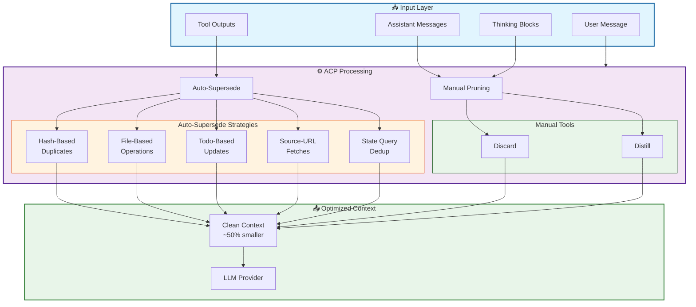
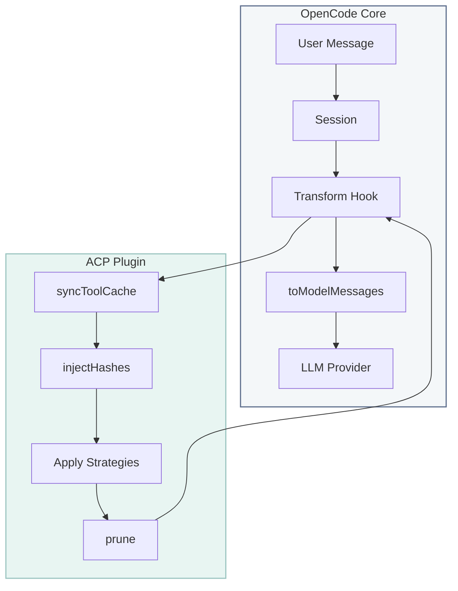

# ACP Architecture Reference

Complete technical documentation for Agentic Context Pruning.

---

## Context Flow



## Plugin Hook Architecture



ACP hooks into OpenCode's message flow to reduce context size before sending to the LLM:

1. **Sync Tool Cache** — Updates internal tool state tracking
2. **Inject Hashes** — Makes content addressable for pruning
3. **Apply Strategies** — Runs auto-supersede mechanisms
4. **Prune** — Applies manual and automatic pruning rules

---

## Table of Contents

1. [Memory Retention Hierarchy](#memory-retention-hierarchy)
2. [Auto-Supersede System](#auto-supersede-system)
3. [Aggressive Pruning Strategies](#aggressive-pruning-strategies)
4. [Protected Content](#protected-content)
5. [Decision Tree](#decision-tree)
6. [Status Bar Behavior](#status-bar-behavior)
7. [Provider Compatibility](#provider-compatibility)
8. [Context Budgeting](#context-budgeting)

---

## Memory Retention Hierarchy

Not all context is equal. Rank content by **retention priority**:

| Priority         | Content Type                                       | Prune Strategy       |
| ---------------- | -------------------------------------------------- | -------------------- |
| 🔴 **Critical**  | Active todo state, current task, user instructions | **NEVER** prune      |
| 🟡 **Important** | File contents being edited, recent tool results    | Distill with summary |
| 🟢 **Ephemeral** | Old tool outputs, completed analysis, logs         | Discard aggressively |
| ⚫ **Temporary** | Error outputs, retry attempts, superseded content  | Auto-prune           |

### The Golden Rule

> **Prune the elaborate, anchor the essential.**

**Elaborate** (Safe to prune):

- Full file contents you've already analyzed
- Old tool outputs from completed steps
- Thinking blocks whose conclusions you've captured
- Superseded versions of anything

**Essential** (Must preserve):

- Current task state and todos
- User requirements and constraints
- Recent analysis conclusions
- Active file edit context

---

## Auto-Supersede System

Automatic context cleanup runs in `syncToolCache()` before any agentic strategies.

### Supersede Types

| Type      | Trigger                 | Action                                  | Emoji |
| --------- | ----------------------- | --------------------------------------- | ----- |
| **Hash**  | Same tool + same params | Supersede old call, keep new            | 🔄    |
| **File**  | write/edit to file      | Clear old read/write/edit for same file | 📁    |
| **Todo**  | todowrite or todoread   | Clear all old todowrite AND todoread    | ✅    |
| **URL**   | Same URL fetched        | Clear old webfetch for same URL         | 🔗    |
| **Query** | Same state command      | Clear old ls/find/git status            | 📊    |

### Execution Order

```
syncToolCache()              ← AUTO-SUPERSEDE runs here
├── 1. Hash-based supersede  (same params → supersede old)
├── 2. File-based supersede  (write/edit → clear old read/write/edit)
├── 3. Todo supersede        (todowrite/todoread → clear both old)
├── 4. URL supersede         (webfetch → clear old same-URL fetches)
├── 5. State query supersede (ls/find → clear old same queries)
└── 6. Track in_progress     (set/preserve inProgressSince)

[agentic strategies run AFTER]
```

### File Key Extraction

| Tool              | Key Format                        |
| ----------------- | --------------------------------- |
| read, write, edit | `filePath`                        |
| glob              | `glob:{path}:{pattern}`           |
| grep              | `grep:{path}:{pattern}:{include}` |

### State Query Patterns

```typescript
const STATE_QUERY_PATTERNS = [
    /^ls\s/,
    /^ls$/,
    /^find\s/,
    /^pwd$/,
    /^git\s+status/,
    /^git\s+branch/,
    /^git\s+log/,
    /^tree\s/,
    /^tree$/,
]
```

---

## Aggressive Pruning Strategies

10 strategies enabled by default, targeting ~50% token reduction.

### Strategy Summary

| #   | Strategy                | Config Key            | Token Savings | Risk   |
| --- | ----------------------- | --------------------- | ------------- | ------ |
| 1   | Input Leak Fix          | `pruneToolInputs`     | ~20%          | Low    |
| 2   | Step Marker Filter      | `pruneStepMarkers`    | ~3%           | None   |
| 3   | Source-URL Supersede    | `pruneSourceUrls`     | ~2%           | Low    |
| 4   | State Query Supersede   | `stateQuerySupersede` | ~3%           | Low    |
| 5   | Snapshot Auto-Supersede | `pruneSnapshots`      | Variable      | Medium |
| 6   | Retry Auto-Prune        | `pruneRetryParts`     | ~2%           | Low    |
| 7   | File Part Masking       | `pruneFiles`          | Variable      | Low    |
| 8   | User Code Truncation    | `pruneUserCodeBlocks` | ~5%           | Low    |
| 9   | Error Truncation        | `truncateOldErrors`   | ~2%           | Low    |
| 10  | One-File-One-View       | `aggressiveFilePrune` | ~10%          | Low    |

### Configuration

```jsonc
{
    "strategies": {
        "aggressivePruning": {
            "pruneToolInputs": true,
            "pruneStepMarkers": true,
            "pruneSourceUrls": true,
            "pruneFiles": true,
            "pruneSnapshots": true,
            "pruneRetryParts": true,
            "pruneUserCodeBlocks": true,
            "truncateOldErrors": true,
            "aggressiveFilePrune": true,
            "stateQuerySupersede": true,
        },
    },
}
```

### Strategy Details

#### 1. Input Leak Fix (`pruneToolInputs`)

When tools are superseded, strip `state.input` to metadata-only:

```typescript
// Before (LEAKING)
{ tool: "write", state: { input: { filePath: "x.txt", content: "A".repeat(5000) } } }

// After (FIXED)
{ tool: "write", state: { input: { filePath: "x.txt" } } }  // Content removed
```

#### 2. One-File-One-View (`aggressiveFilePrune`)

Any file operation supersedes ALL previous operations on the same file:

```
read("config.json")   // Turn 1 - superseded
read("config.json")   // Turn 3 - superseded
write("config.json")  // Turn 5 - superseded
read("config.json")   // Turn 7 - KEPT (latest)
```

#### 3. Retry Auto-Prune (`pruneRetryParts`)

Failed tool attempts followed by successful retries:

```typescript
if (status === "error") {
    state.cursors.retries.pendingRetries.set(toolHash, [callId])
} else if (status === "completed" && pendingRetries.has(toolHash)) {
    // Prune all pending retries for this tool+params
    for (const failedCallId of pendingRetries.get(toolHash)!) {
        supersedeToolCall(failedCallId)
    }
}
```

### Compaction Awareness

ACP respects OpenCode's native compaction by checking `time.compacted`:

```typescript
if (part.state.time?.compacted) {
    continue // Don't double-process
}
```

---

## Protected Content

### Protected Tools (Cannot Be Pruned)

| Tool            | Reason                                     |
| --------------- | ------------------------------------------ |
| `context_info`  | System context critical for operation      |
| `task`          | Long-running operations must persist       |
| `todowrite`     | Todo state management is essential         |
| `todoread`      | Todo retrieval must remain available       |
| `context_prune` | The pruning tool cannot prune itself       |
| `batch`         | Batch operations need to persist           |
| `write`         | File writes protected to prevent data loss |
| `edit`          | File edits protected to prevent data loss  |
| `plan_enter`    | Planning mode entry points                 |
| `plan_exit`     | Planning mode exit points                  |

### What Cannot Be Pruned

| Category           | Items                   | Reason                           |
| ------------------ | ----------------------- | -------------------------------- |
| Protected Tools    | See above               | Explicit protection in config    |
| Error Outputs      | Failed tool calls       | System restriction for debugging |
| Superseded Content | Previous calls replaced | Already removed by supersede     |
| Invalid Hashes     | Non-existent hash IDs   | Validation fails silently        |
| Active Operations  | Recently executed tools | Timing/processing protection     |

---

## Decision Tree

```
START: Do you need to prune context?
│
├─ YES → How much context pressure?
│        │
│        ├─ LIGHT (<50% used)
│        │   └─ No pruning needed
│        │
│        ├─ MODERATE (50-75% used)
│        │   └─ What type of content dominates?
│        │       ├─ Old tool outputs → context_prune({ action: "discard", targets: [[hash]] })
│        │       ├─ Old messages → context_prune({ action: "discard", targets: [[msg_hash]] })
│        │       └─ Large thinking → context_prune({ action: "distill", targets: [[hash, "summary"]] })
│        │
│        ├─ HIGH (75-90% used)
│        │   └─ Is there critical information to preserve?
│        │       ├─ YES → Anchor in todos first, then discard
│        │       └─ NO → Aggressive prune all disposable
│        │
│        └─ CRITICAL (>90% used)
│            └─ Can you complete current task without history?
│                ├─ YES → Nuclear prune + focus mode
│                └─ NO → Surgical prune + anchor critical items
│
└─ NO → Continue working (prune proactively, not reactively)
```

### Content Type Guide

| Content                        | Age     | Action                        |
| ------------------------------ | ------- | ----------------------------- |
| File content I just read       | Current | **Keep**                      |
| File content from 5+ turns ago | Old     | **Discard** (can re-read)     |
| Analysis thinking              | Current | **Distill** (keep conclusion) |
| Error output                   | Current | **Keep** (debugging)          |
| Error output from 3+ turns     | Old     | **Discard** (auto-pruned)     |
| Todo list                      | Current | **Keep** (critical state)     |
| Old todo versions              | Old     | **Discard** (superseded)      |

### Color-Coded Priority System

```typescript
// 🔴 CRITICAL - Never prune
{ id: "crit-1", content: "🔴 CRITICAL: User requirement - must support dark mode" }

// 🟡 IMPORTANT - Keep unless absolutely necessary
{ id: "imp-1", content: "🟡 IMPORTANT: Architecture decision - using Strategy pattern" }

// 🟢 NORMAL - Can be distilled or pruned
{ id: "norm-1", content: "🟢 NORMAL: Research notes on library options" }

// 🔵 EPHEMERAL - Safe to discard anytime
{ id: "eph-1", content: "🔵 EPHEMERAL: Debug log from test run" }
```

---

## Status Bar Behavior

### Format

```
「 💬 15(7.5K) ▼ + 🧠 8(16K) ▼ + ⚙️ 39(83.1K) ▼ 」
```

- 💬 **15 messages** pruned, **7.5K tokens** saved
- 🧠 **8 thinking blocks** pruned, **16K tokens** saved
- ⚙️ **39 tools** pruned, **83.1K tokens** saved

### When It Appears

✅ After successful `context_prune()` operations that actually prune items

### When It Disappears

| Situation                | Status Shown? | Solution                |
| ------------------------ | ------------- | ----------------------- |
| After successful prune   | ✅ Yes        | Normal                  |
| Config = `"off"`         | ❌ No         | Change to `"minimal"`   |
| Nothing was pruned       | ❌ No         | Check targets are valid |
| After context compaction | ❌ No         | Use `/acp stats`        |

**Note**: Status is a **notification**, not a persistent dashboard. Use `/acp stats` for history.

### Configuration

```jsonc
{
    "pruneNotification": "minimal", // Options: "minimal" | "detailed" | "off"
}
```

---

## Provider Compatibility

### Thinking Mode API Requirements

When using **Anthropic's API with extended thinking mode**, all assistant messages containing tool calls MUST have a `reasoning_content` field.

| Provider  | Thinking Mode     | Requires `reasoning_content` |
| --------- | ----------------- | ---------------------------- |
| Anthropic | Extended thinking | ✅ Yes                       |
| DeepSeek  | DeepThink         | ✅ Yes                       |
| Kimi      | K1 thinking       | ✅ Yes                       |
| OpenAI    | N/A               | ❌ No                        |
| Google    | N/A               | ❌ No                        |

### Auto-Convert Discard to Distill

For reasoning blocks, ACP automatically converts `discard` to `distill` with a minimal placeholder:

```typescript
// Discarding reasoning would remove reasoning_content field → API error
// Instead, distill with "—" preserves field structure
context_prune({ action: "discard", targets: [["reasoning_hash"]] })
// → Internally converted to distill with "—" summary
```

### The Fix (v3.0.0)

All context_prune tool paths now **always** fetch messages and initialize session state:

```typescript
// Always fetch messages (required for thinking mode API compatibility)
const messagesResponse = await client.session.messages({ path: { id: sessionId } })
await ensureSessionInitialized(client, state, sessionId, logger, messages)
```

---

## Context Budgeting

### Token Allocation

```
Total Context Budget: ~128k tokens

┌─────────────────────────────────────┐
│ System Instructions    │ 5k  │ 4%  │ ← Fixed
├─────────────────────────────────────┤
│ Active Todos           │ 2k  │ 2%  │ ← Critical
├─────────────────────────────────────┤
│ Current File Context   │ 10k │ 8%  │ ← Important
├─────────────────────────────────────┤
│ Recent Tool Results    │ 15k │ 12% │ ← Important
├─────────────────────────────────────┤
│ Working Memory         │ 20k │ 16% │ ← Variable
├─────────────────────────────────────┤
│ Historical Context     │ 76k │ 60% │ ← Prune aggressively
└─────────────────────────────────────┘
```

### Pruning Triggers

- Historical context > 80k tokens → Batch discard old tools
- Historical context > 100k tokens → Aggressive prune all disposable
- Thinking blocks > 20k tokens → Distill or discard

### The Pruning Funnel

```
RAW CONTEXT (100%)
       │
       ▼
┌─────────────────┐
│  Auto-Supersede │ ← Removes duplicates (~20%)
└────────┬────────┘
         ▼
┌─────────────────┐
│ Manual Pruning  │ ← Your control (~40%)
└────────┬────────┘
         ▼
┌─────────────────┐
│ Auto-Prune      │ ← Background cleanup (~10%)
└────────┬────────┘
         ▼
┌─────────────────┐
│ ACTIVE CONTEXT  │ ← What's left (~30%)
└─────────────────┘
```

---

## Implementation Files

| File                        | Purpose                                   |
| --------------------------- | ----------------------------------------- |
| `lib/config/schema.ts`      | Config schema with strategy booleans      |
| `lib/config/defaults.ts`    | Default configuration                     |
| `lib/state/types.ts`        | State type definitions                    |
| `lib/state/tool-cache.ts`   | Supersede logic, input stripping          |
| `lib/messages/prune.ts`     | Hash injection, step filter, file masking |
| `lib/strategies/context.ts` | Unified context tool                      |
| `lib/strategies/discard.ts` | Discard operations                        |
| `lib/strategies/distill.ts` | Distill operations                        |

---

**Remember**: Context pruning is not about memory loss—it's about **strategic forgetting**. Keep what matters, shed what doesn't.
