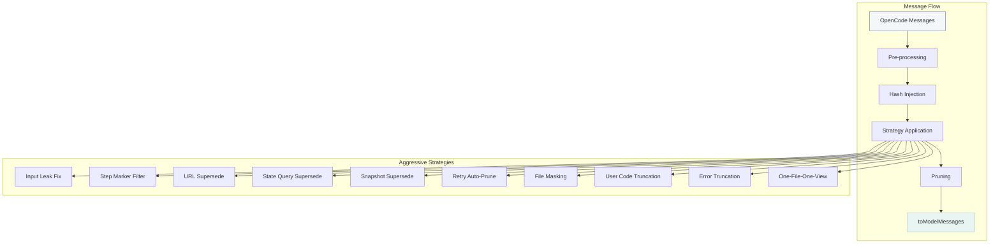

# Aggressive Pruning Technical Reference

Complete technical documentation for ACP's aggressive context pruning features.

## Overview

Aggressive pruning extends ACP's auto-pruning capabilities with 10 new strategies designed to reduce context window usage by up to **~50%**. These strategies are **enabled by default** (opt-out) and target different types of context bloat.

## Architecture



## Strategies

### 1. Input Leak Fix (`pruneToolInputs`)

**Problem:** When tools are superseded (e.g., a `write` followed by a `read`), only the output was hidden. The input field containing large file contents persisted in context.

**Solution:** Strip `state.input` to metadata-only when superseding:

```typescript
// Before (LEAKING)
{
  tool: "write",
  state: {
    input: { filePath: "test.txt", content: "A".repeat(5000) },
    output: "[auto-superseded]"
  }
}

// After (FIXED)
{
  tool: "write",
  state: {
    input: { filePath: "test.txt" },  // Content removed!
    output: "[auto-superseded]"
  }
}
```

**Implementation:**

- `lib/state/tool-cache.ts` — `stripInputToMetadata()` in `supersedeToolCall()`
- `lib/messages/prune.ts` — `stripInputToMetadata()` in `applyPrune()`

**Token Savings:** ~20%

---

### 2. Step Marker Filter (`pruneStepMarkers`)

**Problem:** `step-start` and `step-finish` markers are structural metadata that consume tokens (~50-100 each) but provide no semantic content.

**Solution:** Filter out step markers entirely before context is sent to the model.

```typescript
export const filterStepMarkers = (messages: WithParts[]): void => {
    for (const msg of messages) {
        msg.parts = parts.filter(
            (part) => part.type !== "step-start" && part.type !== "step-finish",
        )
    }
}
```

**Implementation:**

- `lib/messages/prune.ts` — `filterStepMarkers()`

**Token Savings:** ~3%

---

### 3. Source-URL Supersede (`pruneSourceUrls`)

**Problem:** Multiple `webfetch` or `websearch` calls for the same URL/query accumulate in context.

**Solution:** Track URLs and supersede older fetches when a new one completes.

```typescript
// URL key extraction
function extractUrlKey(tool: string, params: Record<string, unknown>): string | null {
    if (tool === "webfetch") return params.url as string
    if (tool === "websearch") return `search:${params.query}`
    return null
}
```

**State Tracking:**

- `state.cursors.urls.urlToCallIds: Map<string, Set<string>>`

**Implementation:**

- `lib/state/tool-cache.ts` — `extractUrlKey()`, URL supersede in `syncToolCache()`

**Token Savings:** ~2%

---

### 4. State Query Supersede (`stateQuerySupersede`)

**Problem:** Commands like `ls`, `find`, `git status` accumulate but only the latest matters.

**Solution:** Detect state queries and keep only the latest execution.

```typescript
const STATE_QUERY_PATTERNS = [
    /^ls\s/,
    /^ls$/,
    /^find\s/,
    /^pwd$/,
    /^git\s+status/,
    /^git\s+branch/,
    /^git\s+log/,
    /^tree\s/,
    /^tree$/,
]
```

**State Tracking:**

- `state.cursors.stateQueries.queryToCallIds: Map<string, Set<string>>`

**Implementation:**

- `lib/state/tool-cache.ts` — `isStateQueryCommand()`, `extractStateQueryKey()`

**Token Savings:** ~3%

---

### 5. Snapshot Auto-Supersede (`pruneSnapshots`)

**Problem:** Snapshots can be very large and old ones become irrelevant.

**Solution:** Automatically supersede all previous snapshots when a new one appears.

**State Tracking:**

- `state.cursors.snapshots.allCallIds: Set<string>`
- `state.cursors.snapshots.latestCallId: string | null`

**Implementation:**

- `lib/state/tool-cache.ts` — Snapshot tracking in `syncToolCache()`

**Token Savings:** Variable (can be significant)

---

### 6. Retry Auto-Prune (`pruneRetryParts`)

**Problem:** Failed tool attempts followed by successful retries leave both in context.

**Solution:** Detect error→success sequences and prune the failed attempt.

```typescript
// Detect retry pattern
if (status === "error") {
    state.cursors.retries.pendingRetries.set(toolHash, [callId])
} else if (status === "completed" && pendingRetries.has(toolHash)) {
    // Prune all pending retries for this tool+params
    for (const failedCallId of pendingRetries.get(toolHash)!) {
        supersedeToolCall(failedCallId)
    }
}
```

**State Tracking:**

- `state.cursors.retries.pendingRetries: Map<string, string[]>`

**Implementation:**

- `lib/state/tool-cache.ts` — Retry detection in `syncToolCache()`

**Token Savings:** ~2%

---

### 7. File Part Masking (`pruneFiles`)

**Problem:** File attachments (images, documents) contain large binary data.

**Solution:** Mask file parts with breadcrumbs, no caching (agent must re-fetch if needed).

```typescript
function createFilePartBreadcrumb(part: Part): string {
    if (part.type === "file") {
        return `[File: ${part.name}, ${Math.round(part.size / 1024)}KB]`
    }
    return "[file]"
}
```

**Implementation:**

- `lib/messages/prune.ts` — `isFilePart()`, `createFilePartBreadcrumb()`, `maskFileParts()`

**Token Savings:** Variable (depends on file size)

---

### 8. User Code Block Truncation (`pruneUserCodeBlocks`)

**Problem:** Large code blocks in old user messages consume significant tokens.

**Solution:** Truncate code blocks older than 5 turns.

````typescript
const CODE_BLOCK_REGEX = /```(\w+)?\n([\s\S]*?)```/g
const MAX_AGE_TURNS = 5

// Replace with:
// [Code block: typescript, 15 lines - truncated to save context]
````

**Implementation:**

- `lib/strategies/truncation.ts` — `truncateUserCodeBlocks()`

**Token Savings:** ~5%

---

### 9. Error Output Truncation (`truncateOldErrors`)

**Problem:** Error outputs with full stack traces persist indefinitely.

**Solution:** Truncate old errors (older than 3 turns) to first line only.

```typescript
// Before:
Error: Something failed
Stack trace:
  at /path/file.ts:123
  at /path/file.ts:456
  ... (500 chars total)

// After:
Error: Something failed
[Error output truncated - 500 chars total]
```

**Implementation:**

- `lib/strategies/truncation.ts` — `truncateErrorOutputs()`

**Token Savings:** ~2%

---

### 10. One-File-One-View (`aggressiveFilePrune`)

**Problem:** Multiple operations on the same file accumulate (read→read, read→write→read).

**Solution:** Any file operation supersedes ALL previous operations on the same file.

```typescript
// Legacy: Only write→read supersede
// Aggressive: ANY file op supersedes ALL previous

read("config.json") // Turn 1
read("config.json") // Turn 3 — supersesdes Turn 1
write("config.json") // Turn 5 — supersedes Turn 3
read("config.json") // Turn 7 — supersedes Turn 5
// Result: Only Turn 7 visible
```

**Implementation:**

- `lib/state/tool-cache.ts` — Modified file supersede in `syncToolCache()`

**Token Savings:** ~10%

---

## Configuration

All aggressive pruning strategies are controlled via `strategies.aggressivePruning`:

```jsonc
{
    "strategies": {
        "aggressivePruning": {
            "pruneToolInputs": true, // Fix input leak
            "pruneStepMarkers": true, // Filter step markers
            "pruneSourceUrls": true, // URL deduplication
            "pruneFiles": true, // File masking
            "pruneSnapshots": true, // Snapshot supersede (opt-out)
            "pruneRetryParts": true, // Retry cleanup
            "pruneUserCodeBlocks": true, // Code truncation
            "truncateOldErrors": true, // Error truncation
            "aggressiveFilePrune": true, // One-file-one-view
            "stateQuerySupersede": true, // State query dedup
        },
    },
}
```

**Opt-out Behavior:** All strategies default to `true`. Set to `false` to disable.

---

## Compaction Awareness

ACP respects OpenCode's native compaction by checking `time.compacted`:

```typescript
// Skip already-compacted parts
if (part.state.time?.compacted) {
    continue // Don't double-process
}
```

This prevents double-pruning of content already compacted by OpenCode.

---

## State Persistence

Aggressive pruning state survives session restarts:

```typescript
// Persisted fields
state.hashRegistry.fileParts // File part hashes
state.cursors.urls.urlToCallIds // URL tracking
state.cursors.stateQueries.queryToCallIds // State queries
state.cursors.snapshots // Snapshot tracking
state.cursors.retries.pendingRetries // Retry tracking
```

---

## Testing

See `docs/test_prompt.md` for 11 new test cases (t35-t45):

| Test | Strategy          | Description                         |
| ---- | ----------------- | ----------------------------------- |
| t35  | Input Leak        | Verify inputs stripped on supersede |
| t36  | One-File-One-View | Reads supersede reads               |
| t37  | Step Markers      | Markers filtered from context       |
| t38  | Source-URL        | URL fetches deduplicated            |
| t39  | State Query       | ls/find keep only latest            |
| t40  | Snapshot          | Only latest snapshot retained       |
| t41  | Retry             | Failed attempts pruned on success   |
| t42  | File Masking      | Attachments masked with breadcrumbs |
| t43  | User Code         | Old code blocks truncated           |
| t44  | Error             | Old errors truncated to first line  |
| t45  | Compaction        | Respects `time.compacted`           |

---

## Impact Summary

| Strategy          | Token Savings | Risk Level |
| ----------------- | ------------- | ---------- |
| Input Leak Fix    | ~20%          | Low        |
| One-File-One-View | ~10%          | Low        |
| Step Markers      | ~3%           | None       |
| Source-URL        | ~2%           | Low        |
| State Query       | ~3%           | Low        |
| Snapshot          | Variable      | Medium     |
| Retry             | ~2%           | Low        |
| File Masking      | Variable      | Low        |
| User Code         | ~5%           | Low        |
| Error Truncation  | ~2%           | Low        |
| **Total**         | **~50%**      | —          |

---

## Implementation Files

| File                            | Purpose                                   |
| ------------------------------- | ----------------------------------------- |
| `lib/config/schema.ts`          | Config schema with 10 booleans            |
| `lib/config/defaults.ts`        | Aggressive defaults                       |
| `lib/state/types.ts`            | State type definitions                    |
| `lib/state/state.ts`            | State initialization                      |
| `lib/state/persistence.ts`      | Serialization                             |
| `lib/state/tool-cache.ts`       | Supersede logic, input stripping          |
| `lib/messages/prune.ts`         | Hash injection, step filter, file masking |
| `lib/strategies/truncation.ts`  | Code block and error truncation           |
| `lib/prompts/system/context.ts` | System prompt documentation               |
