# OpenCode - ACP Message Flow

This document describes how the Agentic Context Pruning (ACP) plugin integrates with OpenCode's message system to manage context and enable agent-driven pruning.

## Table of Contents

- [Overview](#overview)
- [Message Flow Architecture](#message-flow-architecture)
- [Transform Hook Integration](#transform-hook-integration)
- [Hash-Based Context Management](#hash-based-context-management)
- [Pruning Tools](#pruning-tools)
- [Automatic Pruning Strategies](#automatic-pruning-strategies)
- [Slash Commands](#slash-commands)
- [Message Schema Alignment](#message-schema-alignment)
- [Key Implementation Details](#key-implementation-details)
- [Migration from v1.x to v2.0.0](#migration-from-v1x-to-v200)

---

## Overview

The ACP plugin hooks into OpenCode's `experimental.chat.messages.transform` hook to:

1. **Track tool calls** - Build a cache of prunable tool outputs with stable hash identifiers
2. **Inject hashes** - Prepend hash identifiers to tool outputs for easy reference
3. **Prune content** - Replace tool outputs with compact breadcrumbs when marked for pruning
4. **Apply strategies** - Automatically deduplicate, supersede writes, purge errors, and detect overlapping reads
5. **Track effectiveness** - Monitor token savings per strategy


---

## Message Flow Architecture

### High-Level Sequence


### Message Lifecycle States


---

## Transform Hook Integration

The ACP plugin registers a handler for `experimental.chat.messages.transform`. This hook is called **before** messages are converted to the LLM's format.

### Hook Execution Flow

```mermaid
flowchart TD
    subgraph "OpenCode (prompt.ts)"
        A[sessionMessages = clone msgs] --> B[Plugin.trigger transform hook]
        B --> C[toModelMessages sessionMessages]
        C --> D[Send to LLM]
    end

    subgraph "ACP Plugin (hooks.ts)"
        B --> E{isSubAgent?}
        E -->|Yes| F[Return early]
        E -->|No| G[syncToolCache]
        G --> H[injectHashesIntoToolOutputs]
        H --> I[deduplicate]
        I --> J[supersedeWrites]
        J --> K[purgeErrors]
        K --> L[fuzzyDeduplication]
        L --> M[prune]
        M --> N[saveContext]
        N --> B
    end

    style A fill:#fff9c4
    style D fill:#c8e6c9
    style H fill:#bbdefb
    style M fill:#ffcdd2
```



### Critical Insight: Messages ARE Sent to LLM

From OpenCode's `prompt.ts` (lines ~370-385):

```typescript
const sessionMessages = clone(msgs)

// Plugin modifies sessionMessages in-place
await Plugin.trigger("experimental.chat.messages.transform", {}, { messages: sessionMessages })

// Modified messages are converted and sent to LLM
const result = await processor.process({
  messages: [...MessageV2.toModelMessages(sessionMessages, model), ...],
})
```

**Key Points:**

- Messages are cloned before the hook
- Hook modifies the clone in-place
- Modified messages flow to `toModelMessages()`
- Hash-injected tool outputs ARE included in LLM context

---

## Hash-Based Context Management

ACP v2.0.0 uses a hash-based system for identifying and managing tool outputs. Each tool output is prefixed with a unique hash identifier that agents use to reference specific tools for pruning.

### Hash Format

```
#x_xxxxx#
```

- **Prefix**: `#` indicates a hash identifier
- **Type letter**: Indicates the tool type (e.g., `r` for read, `g` for glob, `b` for bash)
- **Hash**: 5-character alphanumeric hash based on tool name and input parameters
- **Suffix**: `#` closes the identifier

**Examples:**

- `#r_a1b2c#` - A read tool output
- `#g_d4e5f#` - A glob tool output
- `#b_12345#` - A bash tool output

### Hash Injection Process


### Bidirectional Hash Mapping

The state maintains two maps for efficient hash resolution:

```typescript
interface SessionState {
    // Hash → callID: For resolving agent's hash references
    hashToCallId: Map<string, string>

    // callID → Hash: For checking if a tool already has a hash
    callIdToHash: Map<string, string>
}
```

---

## Pruning Tools

ACP provides three tools for managing context: `discard`, `distill`, and `restore`.

### discard

Removes tool outputs from context without preservation.

```typescript
// Basic usage
discard({
    hashes: ["#r_a1b2c#", "#g_d4e5f#"],
    reason: "completion",
})

// Reason options:
// - "noise": Irrelevant or unhelpful output
// - "completion": Task done, no longer needed
// - "superseded": Newer output replaces this
// - "exploration": Dead-end investigation
// - "duplicate": Same content read multiple times
```

**Error Messages:**

When trying to discard protected content, you'll see helpful error messages:

```
Cannot discard: 'task' is a protected tool.
Protected tools: discard, distill, task, todowrite, todoread, batch, write, edit, plan_enter, plan_exit
To modify protection, update 'tools.settings.protectedTools' in your ACP config.
```

```
Cannot discard: /path/to/package.json is a protected file path.
Protected patterns: package.json, *.lock, .env*
To modify protection, update 'protectedFilePatterns' in your ACP config.
```

### distill

```typescript
// Standard distillation (prunes after distilling)
distill([
    { hash: "#r_a1b2c#", replace_content: "Key findings..." },
    { hash: "#r_d4e5f#", replace_content: "Summary..." },
])

// Distill mode (distills and prunes)
distill([{ hash: "#r_a1b2c#", replace_content: "Key findings..." }])
```

### restore

Restores previously pruned tool outputs.

```typescript
// Restore single tool
restore({
    hashes: ["#r_a1b2c#"],
})

// Restore multiple tools
restore({
    hashes: ["#r_a1b2c#", "#g_d4e5f#", "#b_12345#"],
})
```

**Note:** Only tools pruned in the current session can be restored. The restore tool removes tools from the prune list, making their original content visible again.

### Breadcrumb Format

When a tool output is pruned, it's replaced with a compact breadcrumb:

```
[Output removed to save context - information superseded or no longer needed]
read({filePath: "/path/to/file.ts"}) → completed
```

**Key Parameters by Tool:**

| Tool            | Parameters Shown              |
| --------------- | ----------------------------- |
| `read`          | `filePath`, `offset`, `limit` |
| `write`, `edit` | `filePath`                    |
| `glob`          | `pattern`, `path`             |
| `grep`          | `pattern`, `include`, `path`  |
| `bash`          | `command`, `description`      |
| `webfetch`      | `url`                         |
| `task`          | `description`                 |

---

## Automatic Pruning Strategies

ACP applies several automatic strategies that run on every transform hook invocation:

### 1. Deduplication

Identifies repeated tool calls with identical parameters and keeps only the most recent output.


### 2. Fuzzy Deduplication (Overlapping Reads)

Detects when a file is read with overlapping ranges and prunes the smaller/older reads.

```typescript
// Example: These reads overlap
read({ filePath: "config.ts", offset: 0, limit: 50 }) // #r_abc#
read({ filePath: "config.ts", offset: 0, limit: 100 }) // #r_def#

// Result: #r_abc# is pruned (fully contained within #r_def#)
```

### 3. Supersede Writes

Prunes write tool inputs for files that have been subsequently read. When a file is written and later read, the original write content becomes redundant since the current file state is captured in the read result.

### 4. Purge Errors

Prunes tool inputs for tools that returned errors after a configurable number of turns (default: 4). Error messages are preserved, but the potentially large input content is removed.

### Strategy Effectiveness Tracking

Each strategy tracks its token savings:

```typescript
interface StrategyStats {
    deduplication: { count: number; tokens: number }
    supersedeWrites: { count: number; tokens: number }
    purgeErrors: { count: number; tokens: number }
    manualDiscard: { count: number; tokens: number }
    distillation: { count: number; tokens: number }
}
```

View effectiveness with `/acp stats`:

```
Strategy Effectiveness:
────────────────────────────────────────────────────────────
Supersede Writes     12 prunes, ~10.2k saved ⭐
Deduplication        45 prunes, ~3.4k saved
Manual Discard        8 prunes, ~2.1k saved
Purge Errors          5 prunes, ~890 saved
Distillation          3 prunes, ~450 saved
```

---

## Slash Commands

ACP provides several `/acp` commands for managing and monitoring context:

### /acp

Shows available ACP commands.

```
╭───────────────────────────────────────────────────────────╮
│                      ACP Commands                         │
╰───────────────────────────────────────────────────────────╯

  /acp context      Show token usage breakdown for current session
  /acp stats        Show ACP pruning statistics
  /acp sweep [n]    Prune tools since last user message, or last n tools
  /acp protected    Show protected tools and file patterns
  /acp budget       Show context budget and recommendations
```

### /acp context

Shows a breakdown of your current session's token usage by category (system, user, assistant, tools, etc.) and how much has been saved through pruning.

### /acp stats

Shows cumulative pruning statistics across all sessions, including strategy effectiveness.

```
╭───────────────────────────────────────────────────────────╮
│                    ACP Statistics                         │
╰───────────────────────────────────────────────────────────╯

Session:
────────────────────────────────────────────────────────────
  Tokens pruned: ~12.4k
  Tools pruned:   73

Strategy Effectiveness:
────────────────────────────────────────────────────────────
  Supersede Writes   12 prunes, ~10.2k saved ⭐
  Deduplication      45 prunes, ~3.4k saved
  Manual Discard      8 prunes, ~2.1k saved

All-time:
────────────────────────────────────────────────────────────
  Tokens saved:  ~45.2k
  Tools pruned:   312
  Sessions:       15
```

### /acp sweep [n]

Prunes all tools since the last user message. Accepts an optional count: `/acp sweep 10` prunes the last 10 tools. Respects `commands.protectedTools`.

### /acp protected

Shows protected tools and file patterns.

```
╭───────────────────────────────────────────────────────────╮
│                   Protected from Pruning                  │
╰───────────────────────────────────────────────────────────╯

📋 Protected Tools:
   These tools cannot be discarded:
   • discard
   • distill
   • task
   • todowrite
   • todoread
   • batch
   • write
   • edit
   • plan_enter
   • plan_exit

📁 Protected File Patterns:
   Files matching these patterns cannot be discarded:
   • package.json
   • *.lock
   • .env*

🔧 Strategy-Specific Protection:
   Deduplication: none
   Purge Errors: none

💡 To modify protection, update your ACP config:
   ~/.config/opencode/acp.jsonc
```

### /acp budget

Shows context budget, usage, and recommendations.

```
╭───────────────────────────────────────────────────────────╮
│                    Context Budget                         │
╰───────────────────────────────────────────────────────────╯

📊 Current Usage:
   Total:     ~12,450 tokens
   System:    ~2,100 tokens
   User:      ~1,200 tokens
   Assistant: ~3,150 tokens
   Tools:     ~6,000 tokens (45 tools)

✂️  Pruning History:
   Total tokens saved: ~8,230
   Total tools pruned: 73
   Recent discards: 12

💡 Recommendations:
   ✅ Context size is healthy.
   Batch size guide: Batch 5-10 tools at a time

⚡ Quick Actions:
   • Run '/acp sweep' to prune since last message
   • Run '/acp context' for detailed breakdown
   • Use discard({hashes: [...], reason: 'completion'})
```

---

## Message Schema Alignment

### OpenCode Message Structure (v2)


### Schema Alignment Checklist

| Field                   | OpenCode Schema                                    | ACP Usage                   | Status |
| ----------------------- | -------------------------------------------------- | --------------------------- | ------ |
| `TextPart.type`         | `"text"`                                           | `"text"`                    | ✅     |
| `TextPart.ignored`      | `boolean?`                                         | Not set on injected content | ✅     |
| `ToolPart.type`         | `"tool"`                                           | `"tool"`                    | ✅     |
| `ToolPart.tool`         | `string`                                           | Tool name                   | ✅     |
| `ToolPart.state.status` | `"completed" \| "error" \| "pending" \| "running"` | Same                        | ✅     |
| `Message.info.role`     | `"user" \| "assistant"`                            | Same                        | ✅     |

### Critical: `ignored` Flag Behavior

From OpenCode's `message-v2.ts`:

```typescript
// Text parts with ignored=true are NOT sent to LLM
if (part.type === "text" && !part.ignored) userMessage.parts.push({ type: "text", text: part.text })
```

**ACP ensures:**

- Hash-injected tool outputs do NOT have `ignored: true`
- UI notifications (not for LLM) use `ignored: true`

---

## Key Implementation Details

### Protected Tools

These tools are protected from pruning and do not receive hash prefixes:

```typescript
const DEFAULT_PROTECTED_TOOLS = [
    "discard", // Context management tool
    "distill", // Context management tool
    "restore", // Context management tool
    "task", // Subagent tool
    "todowrite", // Todo management
    "todoread", // Todo management
    "batch", // Batch operations
    "write", // File writes
    "edit", // File edits
    "plan_enter", // Planning
    "plan_exit", // Planning
]
```

### Turn Protection

When enabled, turn protection prevents tool outputs from being pruned for a configurable number of message turns. This gives the AI time to reference recent tool outputs before they become prunable.

### Debug Logging Points

| Location        | Log Message                 | Purpose                               |
| --------------- | --------------------------- | ------------------------------------- |
| `hooks.ts`      | "Transform starting"        | Track message count before transforms |
| `hooks.ts`      | "Transform complete"        | Verify messages processed             |
| `tool-cache.ts` | "Cached tool id: X hash: Y" | Track hash generation                 |
| `prune.ts`      | "Injected hash X into Y"    | Verify hash injection                 |

### Verification Commands

Check debug logs:

```bash
cat ~/.config/opencode/logs/acp/daily/$(date +%Y-%m-%d).log | tail -100
```

Check context snapshots:

```bash
ls ~/.config/opencode/logs/acp/context/ses_*/
```

---

## Summary


**Key Takeaways:**

1. **Hash-based identification** - Each tool output has a unique hash prefix (`#r_a1b2c#`)
2. **Three pruning tools** - `discard`, `distill`, and `restore` for full control
3. **Messages ARE sent to LLM** - The transform hook modifies messages in-place before `toModelMessages()`
4. **Breadcrumbs preserve context** - Pruned outputs show `tool({params}) → status`
5. **Protected tools skip hashing** - Core tools like `discard`, `distill`, `task` are protected
6. **Automatic strategies** - Deduplication, fuzzy deduplication, supersede writes, and purge errors run automatically
7. **Strategy effectiveness tracking** - Monitor which strategies save the most tokens
8. **~80-90% context overhead reduction** - No more `<prunable-tools>` list injection every turn

---

## Auto-Pruning After Tool Execution (v2.2.1+)

Starting from v2.2.1, ACP supports automatic pruning immediately after each tool execution, not just before sending to the LLM.

### How It Works


### Configuration

```jsonc
{
    // Enable/disable auto-pruning after each tool (default: true)
    "autoPruneAfterTool": true,
}
```

### Simplified Notification Format (v2.2.3+)

Notifications now use a cleaner format without tool name prefixes:

**Before (v2.2.0):**

```
▣ Pruning (~1.1K) — Task Complete
→ read: lib/config.ts
→ read: lib/hooks.ts
```

**After (v2.2.3+):**

```
▣ Pruning (~1.1K) — Task Complete
lib/config.ts
lib/hooks.ts
```

### Hooks Used

| Hook                                   | Purpose                 | When                      |
| -------------------------------------- | ----------------------- | ------------------------- |
| `experimental.chat.messages.transform` | Full pruning before LLM | Before each LLM call      |
| `tool.execute.after`                   | Lightweight pruning     | After each tool completes |

---

## Testing Methodology

### Automated Testing with Bash

Use `opencode run` to test ACP functionality in a fresh session:

```bash
# Build, link locally, and test
npm run build && npm link && opencode run "read some files, then read again, then discard for testing"
```

### Test Scenarios

#### 1. Deduplication Test

```bash
opencode run "read lib/hooks.ts twice and observe auto-pruning"
```

Expected: First read is auto-pruned when second read completes.

#### 2. Protected Files Test

```bash
opencode run "try to discard package.json and observe the error"
```

Expected: Error message explaining the file is protected.

#### 3. Manual Discard Test

```bash
opencode run "read lib/config.ts, then discard it using the hash"
```

Expected: Simplified notification format without `→ read:` prefix.

#### 4. Restore Test

```bash
opencode run "read a file, discard it, then restore it"
```

Expected: Content is restored and visible again.

### Verification Commands

```bash
# Check latest version
npm view @tuanhung303/opencode-acp version

# Check all versions
npm view @tuanhung303/opencode-acp versions --json

# Check debug logs
cat ~/.config/opencode/logs/acp/daily/$(date +%Y-%m-%d).log | tail -100

# Quick deploy workflow
npm run build && npm version patch --no-git-tag-version && npm publish --access public
```

---

## Future Improvement Recommendations

This section documents potential strategies for future agents to implement when context capacity becomes a concern.

### Priority 1: Head-Tail Truncation

**Problem:** Large file reads consume significant context even when only parts are relevant.

**Solution:** Truncate tool outputs that exceed a threshold, keeping head and tail with a summary.

```typescript
// Proposed implementation
interface TruncationConfig {
    enabled: boolean
    maxTokens: number // e.g., 2000 tokens
    headRatio: number // e.g., 0.4 (40% head)
    tailRatio: number // e.g., 0.4 (40% tail)
    summaryTokens: number // e.g., 200 tokens for middle summary
}

// Example output after truncation:
// [First 800 tokens of file...]
//
// --- [Truncated: ~3,200 tokens removed. Middle section contained
//     function definitions for: handleAuth, validateToken, refreshSession] ---
//
// [Last 800 tokens of file...]
```

**Implementation location:** `lib/strategies/truncation.ts`

**Estimated impact:** 30-50% reduction in large file read tokens

### Priority 2: Read Consolidation

**Problem:** Multiple partial reads of the same file create redundant context.

**Solution:** Consolidate overlapping reads into a single unified view.

```typescript
// Before consolidation:
read({ filePath: "config.ts", offset: 0, limit: 50 }) // #r_abc#
read({ filePath: "config.ts", offset: 40, limit: 60 }) // #r_def#
read({ filePath: "config.ts", offset: 90, limit: 50 }) // #r_ghi#

// After consolidation: Single read covering lines 0-140
// Prunes #r_abc#, #r_def#, keeps consolidated #r_ghi# with expanded content
```

**Implementation location:** `lib/strategies/consolidation.ts`

**Estimated impact:** 20-40% reduction when files are read incrementally

### Priority 3: Thinking Block Compression

**Problem:** Extended thinking blocks from Claude can be very large.

**Solution:** Compress or summarize thinking blocks after they've been processed.

```typescript
interface ThinkingCompressionConfig {
    enabled: boolean
    turnsBeforeCompression: number // e.g., 2 turns
    compressionRatio: number // e.g., 0.2 (keep 20%)
}

// Before: Full 5000-token thinking block
// After: 1000-token summary of key reasoning steps
```

**Implementation location:** `lib/strategies/thinking-compression.ts`

**Estimated impact:** 40-60% reduction in thinking block tokens

### Priority 4: Semantic Deduplication

**Problem:** Similar (but not identical) content wastes context.

**Solution:** Use embeddings or hashing to detect semantically similar content.

```typescript
// Example: Two error messages that are essentially the same
// Error 1: "Cannot find module 'lodash' at /path/to/file.ts:42"
// Error 2: "Cannot find module 'lodash' at /path/to/file.ts:42"
//
// Even with different timestamps/metadata, these are semantically identical
```

**Implementation location:** `lib/strategies/semantic-dedup.ts`

**Estimated impact:** 10-20% reduction in repetitive error/log outputs

### Priority 5: Adaptive Pruning Thresholds

**Problem:** Fixed thresholds don't adapt to conversation length.

**Solution:** Dynamically adjust pruning aggressiveness based on context usage.

```typescript
interface AdaptiveConfig {
    enabled: boolean
    thresholds: {
        conservative: number // e.g., 0.3 (30% capacity)
        moderate: number // e.g., 0.5 (50% capacity)
        aggressive: number // e.g., 0.7 (70% capacity)
    }
    actions: {
        conservative: string[] // ["dedup"]
        moderate: string[] // ["dedup", "truncate"]
        aggressive: string[] // ["dedup", "truncate", "compress-thinking"]
    }
}
```

**Implementation location:** `lib/strategies/adaptive.ts`

**Estimated impact:** Prevents context overflow, maintains quality

### Implementation Checklist for Future Agents

When implementing new strategies:

1. **Create strategy file** in `lib/strategies/`
2. **Add config interface** in `lib/config.ts`
3. **Add default config** with `enabled: false` initially
4. **Export from** `lib/strategies/index.ts`
5. **Call from hooks** in `lib/hooks.ts` (both transform and tool.execute.after)
6. **Add strategy stats** tracking in `lib/state/types.ts`
7. **Update `/acp stats`** to show new strategy effectiveness
8. **Write tests** in `tests/strategies/`
9. **Update documentation** in `docs/`
10. **Test with bash:** `npm run build && npm link && opencode run "test scenario"`

### Architecture for New Strategies

```typescript
// Template for new strategy
import { PluginConfig } from "../config"
import { Logger } from "../logger"
import type { SessionState, WithParts } from "../state"
import { calculateTokensSaved } from "./utils"

export const myNewStrategy = (
    state: SessionState,
    logger: Logger,
    config: PluginConfig,
    messages: WithParts[],
): void => {
    if (!config.strategies.myNewStrategy.enabled) {
        return
    }

    // 1. Find candidates for pruning/modification
    // 2. Apply strategy logic
    // 3. Track effectiveness

    const tokensSaved = calculateTokensSaved(state, messages, prunedIds)
    state.stats.strategyStats.myNewStrategy.count += prunedIds.length
    state.stats.strategyStats.myNewStrategy.tokens += tokensSaved

    logger.debug(`MyNewStrategy: processed ${prunedIds.length} items`)
}
```

---

## Migration from v1.x to v2.0.0

### Breaking Changes

| v1.x (Old)                        | v2.0.0 (New)                                      |
| --------------------------------- | ------------------------------------------------- |
| `discard({ids: ["0", "2"]})`      | `discard({hashes: ["#r_a1b2c#"], reason: "..."})` |
| Numeric IDs (0, 1, 2...)          | Hash identifiers (`#r_a1b2c#`)                    |
| `tool_filter` parameter           | Removed - use hashes directly                     |
| `older_than` parameter            | Removed - use turn protection instead             |
| `all` parameter                   | Removed - batch hashes explicitly                 |
| `tools.settings.nudgeEnabled`     | Removed - nudge system eliminated                 |
| `<prunable-tools>` list injection | Removed - hashes embedded in outputs              |

### New Features in v2.0.0

| Feature                              | Description                               |
| ------------------------------------ | ----------------------------------------- |
| `distill([{hash, replace_content}])` | Distill knowledge before pruning          |
| `restore({hashes: []})`              | Undo pruning and restore original content |
| `/acp protected`                     | View protected tools and patterns         |
| `/acp budget`                        | View context usage and recommendations    |
| Fuzzy deduplication                  | Auto-prune overlapping file reads         |
| Strategy effectiveness               | Track token savings per strategy          |
| Better error messages                | Clear explanations for protected content  |

### New Required Parameters

- `discard` now requires a `reason` parameter: `"noise"`, `"completion"`, `"superseded"`, `"exploration"`, or `"duplicate"`

### Benefits of v2.0.0

- **Reduced context overhead**: No more synthetic messages with tool lists
- **Simpler mental model**: Agents see hashes directly in tool outputs
- **More precise control**: Hash directly identifies specific tool calls
- **Undo capability**: Restore accidentally pruned content
- **Better insights**: Strategy effectiveness tracking
- **Improved UX**: Better error messages and new slash commands
- **Better performance**: Eliminates per-turn list generation and injection

---

## Version History

### v2.2.3 (Latest)

- **Fixed:** Simplified notification format now applies to UI notifications (not just tool results)
- **Change:** `sendUnifiedNotification()` now passes `{ simplified: true }` for cleaner output

### v2.2.2

- **Fixed:** Simplified format for `formatPruningResultForTool()` (tool result output)

### v2.2.1

- **Added:** `tool.execute.after` hook for auto-pruning after each tool execution
- **Added:** `autoPruneAfterTool` config option (default: `true`)
- **Added:** Simplified notification format (no `→ read:` prefix)
- **Added:** `NotifyOptions.simplified` parameter for notification formatting

### v2.2.0

- Previous stable release

### Deployment Workflow

```bash
# Standard deployment
make deploy-patch  # Bumps x.x.X and publishes

# Manual deployment
npm run build
npm version patch --no-git-tag-version
npm publish --access public

# Test before deploy
npm run build && npm link && opencode run "test scenario"
```

### NPM Package

- **Package:** `@tuanhung303/opencode-acp`
- **Registry:** https://www.npmjs.com/package/@tuanhung303/opencode-acp
- **Install:** `npm install @tuanhung303/opencode-acp`
